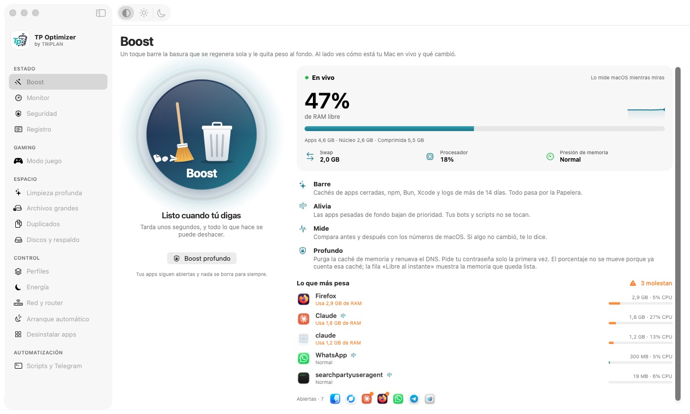
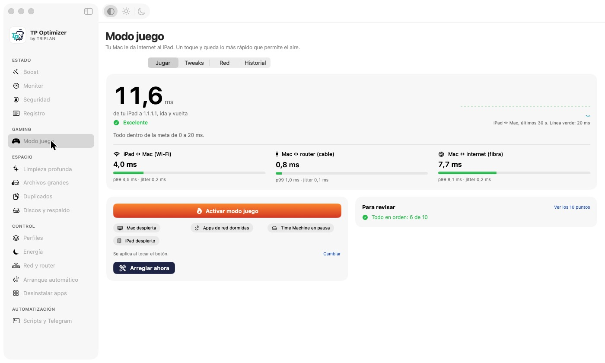

<p align="center">
  
</p>

<p align="center">
  <a href="https://github.com/jenzkupinc/tp-optimizer/releases/latest"></a>
  
  
  
  
</p>

<h3 align="center">Una app de Mac para dejarla ligera con un toque, y para jugar desde un iPad con el Wi-Fi que comparte tu Mac.</h3>

<p align="center"><sub>Gratis, de código abierto y sin telemetría. Hecha con SwiftUI.</sub></p>

---

## ⬇️ Descárgala

**[Bajar TP-Optimizer-1.0.0.dmg](https://github.com/jenzkupinc/tp-optimizer/releases/latest)** · 2,6 MB

1. Abre el `.dmg` y **arrastra TP Optimizer a Aplicaciones**.
2. La primera vez, **clic derecho sobre la app → Abrir → Abrir**. macOS lo pide porque la app no está notarizada por Apple (eso cuesta una cuenta de desarrollador de pago).
3. Si macOS dice que "está dañada", es la misma protección. Quítala con:
   ```bash
   xattr -dr com.apple.quarantine "/Applications/TP Optimizer.app"
   ```

Para comprobar que el archivo es el que publiqué, su huella SHA-256 está en la página de la versión.

> **¿Y en Windows?** No. TP Optimizer usa piezas propias de macOS (SwiftUI, AppKit, `launchctl`, el firewall `pf`, Compartir Internet). No hay versión para Windows ni para Linux, ni tampoco para Macs con procesador Intel.

---

## 📸 Así se ve

<p align="center">
  
  
</p>

---

## 🥇 Boost

Un toque barre cachés viejas, le baja la prioridad a lo pesado que está en segundo plano y te enseña **el antes y el después con los números de macOS**. Nada se borra para siempre: todo va a la Papelera.

**Boost profundo** además purga la caché de memoria y renueva el DNS.

> 📏 **Medido en un Mac mini de 16 GB:** tras un Boost profundo la memoria libre al instante pasó de **0,12 GB a 3,02 GB**. El porcentaje de «RAM libre» casi no se mueve porque macOS ya cuenta la caché como libre. Por eso la app añade la fila **Libre al instante**.

## 🥈 Modo juego

Pensado para quien juega desde un iPad conectado a **Compartir Internet** de su Mac.

- 🟢 **Mide por tramos:** iPad ↔ Mac (Wi-Fi), Mac ↔ router y Mac ↔ internet, cada uno por separado, para saber dónde está el problema.
- 🟡 **Prepara la sesión:** baja la prioridad de lo pesado, duerme apps de red, pausa Time Machine, apaga AirDrop y limita a los demás equipos.
- 🔴 **Te dice la verdad:** «Arreglar ahora» mide los saltos antes y después. Si no mejoraron, lo dice.

Al terminar, todo vuelve a como estaba.

## 🥉 Y además

| Sección | Para qué sirve |
|---|---|
| **Monitor** | Procesos, memoria, CPU y quién usa la red |
| **Seguridad** | Firewall, cifrado de disco, SIP, Gatekeeper y accesos remotos |
| **Limpieza profunda · Archivos grandes · Duplicados** | Los encuentra y los envía a la Papelera |
| **Discos y respaldo** | Respaldo a un disco externo |
| **Perfiles · Energía** | Qué apps duermen y qué impide que la Mac descanse |
| **Red y router** | DNS, equipos conectados y diagnóstico del router |
| **Arranque automático · Desinstalar apps** | Lo que se abre solo y lo que dejan las apps |
| **Scripts y Telegram** | Tus propios scripts y avisos por Telegram, si tú lo activas |

---

## 🔐 Qué pide y por qué

- **Contraseña de administrador, una sola vez.** Algunas funciones (firewall, DNS, límite de ancho de banda) necesitan permisos de root. La app instala un pequeño ayudante, `app.tpoptimizer.root`, y una regla `sudoers` que solo permite ejecutar ese archivo.
- **Sin telemetría.** No manda nada a ninguna parte. Telegram solo funciona si tú pones tu propio token.
- **Un límite que conviene saber:** la regla `sudoers` no restringe los argumentos, así que cualquier programa de tu usuario puede pedirle cosas al ayudante. Cada operación valida lo que recibe, pero instálalo solo en una Mac que controles.

**Para quitarlo todo:** borra la app, `/Library/PrivilegedHelperTools/app.tpoptimizer.root` y `/etc/sudoers.d/tp-optimizer`.

## 🛠️ Compilarla tú mismo

Necesitas macOS 26, Apple Silicon y las herramientas de línea de comandos de Xcode (`xcode-select --install`).

1. Crea un certificado local: *Acceso a Llaveros → Asistente de certificados → Crear un certificado*, nombre `TP Optimizer Local`, tipo **Firma de código**.
2. Compila e instala:
   ```bash
   git clone https://github.com/jenzkupinc/tp-optimizer.git
   cd tp-optimizer
   bash build.sh
   ```

`build.sh` acepta `SIGN_IDENTITY` (otro nombre de certificado) e `INSTALL_DIR` (otra carpeta de destino).

## ✅ Estado

Versión **1.0.0**. Probada a mano en un Mac mini con macOS 26: **Boost, Boost profundo y Modo juego**. Las demás secciones compilan y abren, pero no tienen pruebas manuales completas. Si algo falla, abre un [*issue*](https://github.com/jenzkupinc/tp-optimizer/issues) con el texto del error y tu versión de macOS.

## 🧱 Estructura

```
*.swift      interfaz y lógica de cada sección
helper/      ayudante con privilegios (tp-root.swift)
Resources/   icono y logo
build.sh     compila, firma e instala
```

## 📄 Licencia

[MIT](LICENSE) · Hecha por **TRIPLAN**.
